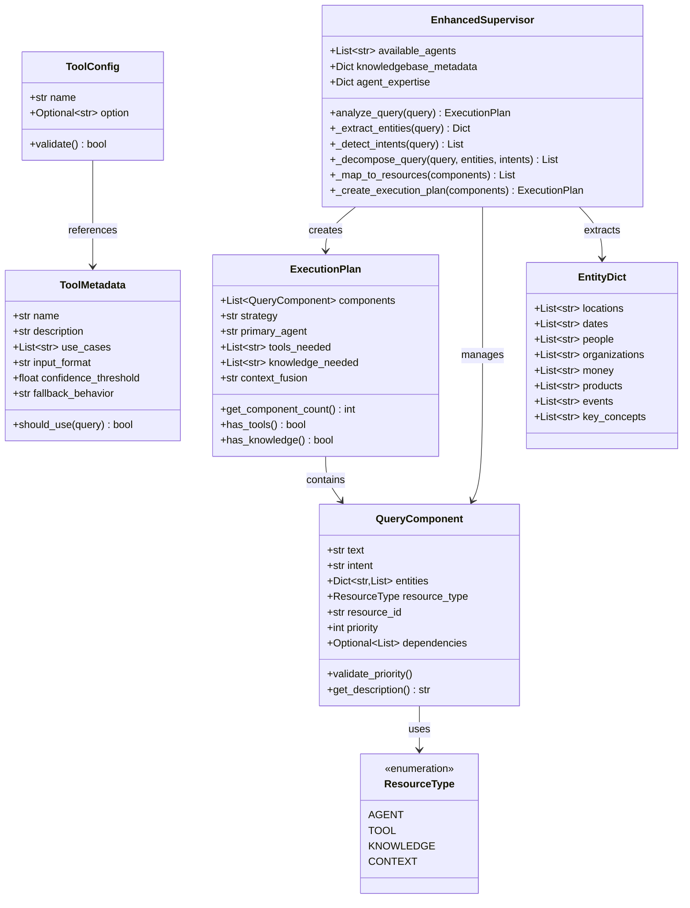
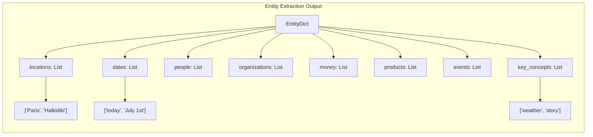

# Data Schemas Class Diagram

```mermaid
classDiagram
    class ResourceType {
        <<enumeration>>
        AGENT
        TOOL
        KNOWLEDGE
        CONTEXT
    }
    
    class QueryComponent {
        +str text
        +str intent
        +Dict~str,List~ entities
        +ResourceType resource_type
        +str resource_id
        +int priority
        +Optional~List~ dependencies
        +validate_priority()
        +get_description() str
    }
    
    class ExecutionPlan {
        +List~QueryComponent~ components
        +str strategy
        +str primary_agent
        +List~str~ tools_needed
        +List~str~ knowledge_needed
        +str context_fusion
        +get_component_count() int
        +has_tools() bool
        +has_knowledge() bool
    }
    
    class EnhancedSupervisor {
        +List~str~ available_agents
        +Dict knowledgebase_metadata
        +Dict agent_expertise
        +analyze_query(query) ExecutionPlan
        +_extract_entities(query) Dict
        +_detect_intents(query) List
        +_decompose_query(query, entities, intents) List
        +_map_to_resources(components) List
        +_create_execution_plan(components) ExecutionPlan
    }
    
    class ToolConfig {
        +str name
        +Optional~str~ option
        +validate() bool
    }
    
    class ToolMetadata {
        +str name
        +str description
        +List~str~ use_cases
        +str input_format
        +float confidence_threshold
        +str fallback_behavior
        +should_use(query) bool
    }
    
    class EntityDict {
        +List~str~ locations
        +List~str~ dates
        +List~str~ people
        +List~str~ organizations
        +List~str~ money
        +List~str~ products
        +List~str~ events
        +List~str~ key_concepts
    }
    
    QueryComponent --> ResourceType : uses
    ExecutionPlan --> QueryComponent : contains
    EnhancedSupervisor --> ExecutionPlan : creates
    EnhancedSupervisor --> QueryComponent : manages
    EnhancedSupervisor --> EntityDict : extracts
    ToolConfig --> ToolMetadata : references
```

## Entity Structure Detail

```mermaid
graph LR
    subgraph "Entity Extraction Output"
        A[EntityDict] --> B[locations: List]
        A --> C[dates: List]
        A --> D[people: List]
        A --> E[organizations: List]
        A --> F[money: List]
        A --> G[products: List]
        A --> H[events: List]
        A --> I[key_concepts: List]
        
        B --> B1["['Paris', 'Halkidiki']"]
        C --> C1["['today', 'July 1st']"]
        I --> I1["['weather', 'story']"]
    end
``` 