# Enhanced Supervisor Flow Diagram

```mermaid
graph TD
    subgraph "Enhanced Supervisor Architecture"
        A["🧠 User Query"] --> B["📊 Query Analysis"]
        
        B --> C["🔍 Entity Extraction"]
        B --> D["🎯 Intent Detection"] 
        B --> E["💡 Context Analysis"]
        
        C --> F["📍 Entities:<br/>• locations: ['Paris']<br/>• dates: ['today']<br/>• key_concepts: ['weather']"]
        D --> G["🎭 Intents:<br/>• humor (priority 1)<br/>• current_events<br/>• storytelling"]
        E --> H["🔗 Context:<br/>• agent_hints: ['parody']<br/>• tool_hints: ['web_search']<br/>• knowledge_hints: ['ciorba']"]
        
        F --> I["🏗️ Component Decomposition"]
        G --> I
        H --> I
        
        I --> J["📋 QueryComponents:<br/>1. humor_creation → parody_creator<br/>2. information_gathering → web_search<br/>3. knowledge_retrieval → ciorba"]
        
        J --> K["⚡ Resource Mapping"]
        K --> L["📅 Execution Planning"]
        
        L --> M["📄 ExecutionPlan:<br/>Strategy: hierarchical<br/>Primary: parody_creator<br/>Tools: [web_search]<br/>Knowledge: [ciorba]<br/>Fusion: humor_integration"]
        
        M --> N["🚀 Orchestrated Execution"]
        N --> O["✨ Enhanced Response"]
    end
```



## How to Convert to Image

### Option 1: Online Tools
1. Copy the mermaid code above
2. Go to https://mermaid.live/
3. Paste the code and download as PNG/SVG

### Option 2: VS Code Extension
1. Install "Mermaid Preview" extension
2. Open this file in VS Code
3. Right-click on the diagram → "Export as PNG/SVG"

### Option 3: Command Line (if you have mermaid-cli installed)
```bash
npx @mermaid-js/mermaid-cli -i enhanced-supervisor-flow.md -o enhanced-supervisor-flow.png
``` 