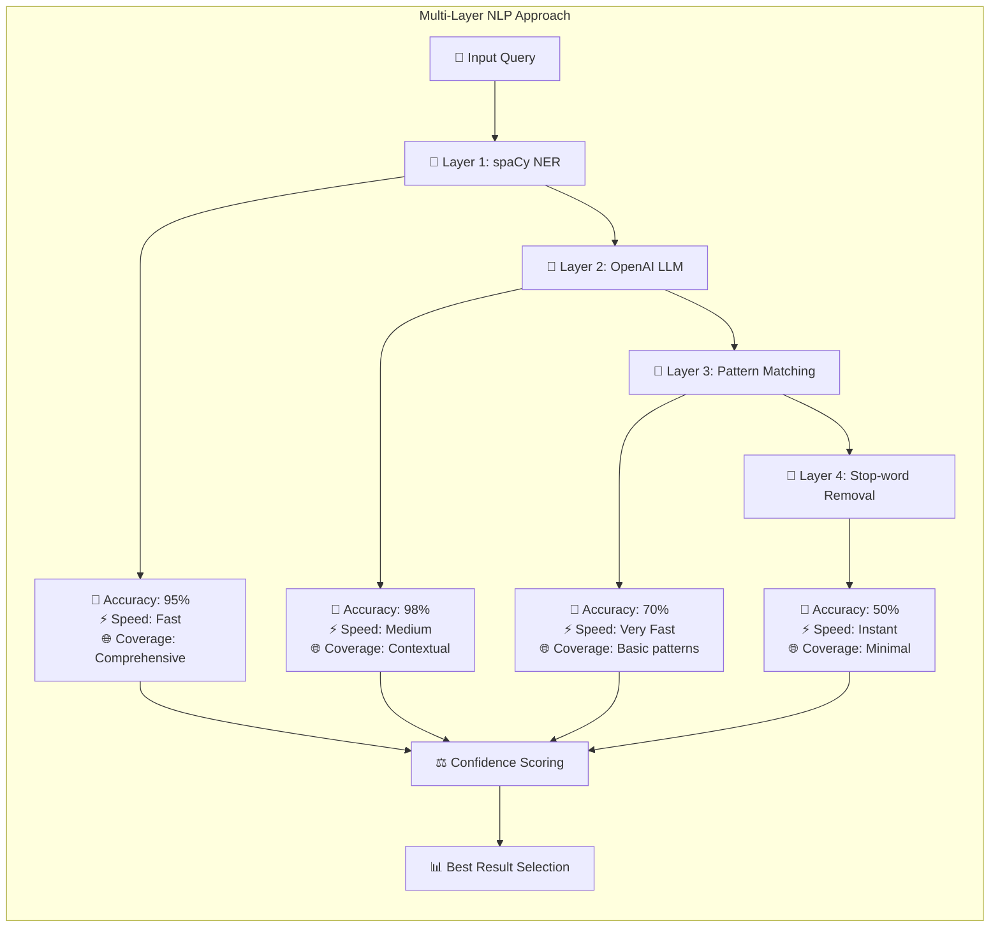

# Hybrid NLP Query Generation Flow

```mermaid
graph TD
    subgraph "Hybrid NLP Pipeline"
        A[🗣️ User Query<br/>"Tell me a funny story about<br/>weather in Halkidiki today"]
        
        A --> B[🔬 Primary: spaCy NER<br/>Named Entity Recognition]
        
        B --> C{🎯 Entities Found?}
        C -->|✅ Yes| D[📍 Extracted Entities<br/>• LOC: Halkidiki<br/>• DATE: today<br/>• CONCEPT: weather, story]
        C -->|❌ No| E[⚠️ Fallback: Pattern Matching]
        
        D --> F[🤖 Secondary: OpenAI LLM<br/>Intelligent Query Composition]
        E --> G[🔍 Rule-based Query Builder<br/>Keyword + Location extraction]
        
        F --> H{🔑 API Available?}
        H -->|✅ Yes| I[🎨 LLM-Generated Query<br/>"current weather forecast Halkidiki Greece today"]
        H -->|❌ No| J[⚡ Smart Fallback<br/>spaCy entities + templates]
        
        G --> K[📝 Pattern-based Query<br/>"weather Halkidiki today"]
        J --> L[🏗️ Template Query<br/>"weather in {location} {date}"]
        
        I --> M[🌐 Web Search Execution]
        K --> M
        L --> M
        
        M --> N[📊 Search Results]
        N --> O[✨ Context-aware Response]
    end
```

## NLP Layers Detail



## Entity Classification Enhancement

```mermaid
graph TD
    subgraph "Entity Classification Process"
        A[🔍 Raw Entity Detection] --> B{🏷️ Entity Type Check}
        
        B -->|Location| C[📍 Location Processing]
        B -->|Date/Time| D[📅 Temporal Processing]
        B -->|Concept| E[💡 Concept Processing]
        B -->|Person| F[👤 Person Processing]
        
        C --> C1[🌍 Known Locations Check<br/>Halkidiki → Greece]
        C1 --> C2[🗺️ Geographic Context<br/>Add country/region info]
        
        D --> D1[⏰ Time Normalization<br/>"today" → current date]
        D1 --> D2[📝 Format Standardization<br/>ISO dates, relative terms]
        
        E --> E1[🔑 Keyword Expansion<br/>"weather" → forecast, conditions]
        E1 --> E2[🎯 Intent Mapping<br/>weather → current_events]
        
        F --> F1[👥 Person Context<br/>Add role/relationship info]
        
        C2 --> G[🔗 Entity Enrichment]
        D2 --> G
        E2 --> G
        F1 --> G
        
        G --> H[🎨 Query Composition<br/>Enhanced search terms]
    end
``` 