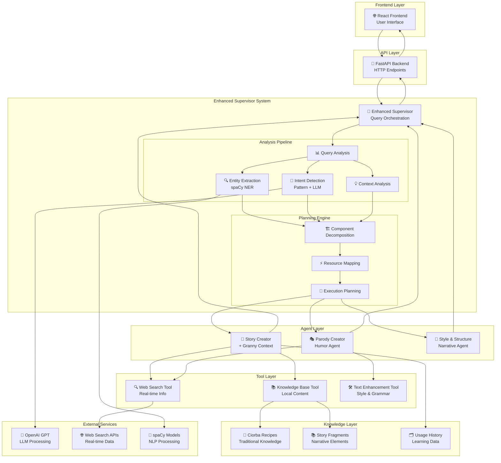
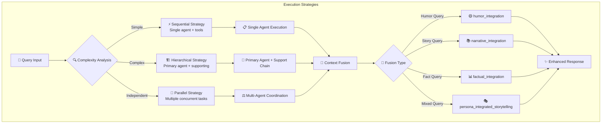

# System Architecture Diagram

```mermaid
graph TB
    subgraph "Frontend Layer"
        UI[🌐 React Frontend<br/>User Interface]
    end
    
    subgraph "API Layer"
        API[🔌 FastAPI Backend<br/>HTTP Endpoints]
    end
    
    subgraph "Enhanced Supervisor System"
        ES[🧠 Enhanced Supervisor<br/>Query Orchestration]
        
        subgraph "Analysis Pipeline"
            QA[📊 Query Analysis]
            EE[🔍 Entity Extraction<br/>spaCy NER]
            ID[🎯 Intent Detection<br/>Pattern + LLM]
            CA[💡 Context Analysis]
        end
        
        subgraph "Planning Engine"
            CD[🏗️ Component Decomposition]
            RM[⚡ Resource Mapping]
            EP[📅 Execution Planning]
        end
    end
    
    subgraph "Agent Layer"
        SCA[👵 Story Creator<br/>+ Granny Context]
        PCA[🎭 Parody Creator<br/>Humor Agent]
        SSA[🎨 Style & Structure<br/>Narrative Agent]
    end
    
    subgraph "Tool Layer"
        WST[🔍 Web Search Tool<br/>Real-time Info]
        KBT[📚 Knowledge Base Tool<br/>Local Content]
        TET[🛠️ Text Enhancement Tool<br/>Style & Grammar]
    end
    
    subgraph "Knowledge Layer"
        KB1[📖 Ciorba Recipes<br/>Traditional Knowledge]
        KB2[📚 Story Fragments<br/>Narrative Elements]
        KB3[🗂️ Usage History<br/>Learning Data]
    end
    
    subgraph "External Services"
        OPENAI[🤖 OpenAI GPT<br/>LLM Processing]
        SEARCH[🌐 Web Search APIs<br/>Real-time Data]
        SPACY[🔬 spaCy Models<br/>NLP Processing]
    end
    
    %% Main Flow
    UI --> API
    API --> ES
    
    %% Analysis Flow
    ES --> QA
    QA --> EE
    QA --> ID
    QA --> CA
    
    %% Planning Flow
    EE --> CD
    ID --> CD
    CA --> CD
    CD --> RM
    RM --> EP
    
    %% Execution Flow
    EP --> SCA
    EP --> PCA
    EP --> SSA
    
    %% Tool Integration
    SCA --> WST
    SCA --> KBT
    PCA --> WST
    PCA --> TET
    
    %% Knowledge Access
    KBT --> KB1
    KBT --> KB2
    SCA --> KB3
    
    %% External Dependencies
    EE --> SPACY
    ID --> OPENAI
    WST --> SEARCH
    
    %% Response Flow
    SCA --> ES
    PCA --> ES
    SSA --> ES
    ES --> API
    API --> UI
```

## Execution Strategy Flow

```mermaid
graph TD
    subgraph "Execution Strategies"
        A[📝 Query Input] --> B{🔍 Complexity Analysis}
        
        B -->|Simple| C[⚡ Sequential Strategy<br/>Single agent + tools]
        B -->|Complex| D[🏗️ Hierarchical Strategy<br/>Primary agent + supporting]
        B -->|Independent| E[🔄 Parallel Strategy<br/>Multiple concurrent tasks]
        
        C --> F[📋 Single Agent Execution]
        D --> G[🎯 Primary Agent + Support Chain]
        E --> H[⚖️ Multi-Agent Coordination]
        
        F --> I[🎨 Context Fusion]
        G --> I
        H --> I
        
        I --> J{🔀 Fusion Type}
        J -->|Humor Query| K[😄 humor_integration]
        J -->|Story Query| L[📚 narrative_integration]
        J -->|Fact Query| M[📊 factual_integration]
        J -->|Mixed Query| N[🎭 persona_integrated_storytelling]
        
        K --> O[✨ Enhanced Response]
        L --> O
        M --> O
        N --> O
    end
``` 